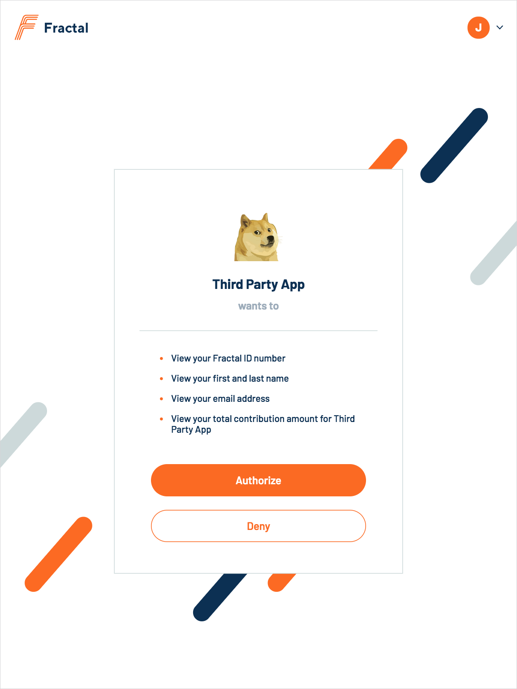

# Fractal ID

Identity provisioning.

## User authentication and authorization

Fractal ID uses the OAuth2 standard to perform authentication of users and authorization of their resources for third-party applications.

Please note that Fractal ID does not yet include a mechanism for the creation of new user accounts. For the moment, this is done through integrations Fractal controls.

### Scopes

We have the following scopes available:
  * `identity.basic`
  * `idendity.name:read`
  * `identity.email:read`
  * `third_party.{third-party-name}.contribution:read`

### OAuth2 flow

If someone is not logged into your app, you should redirect them to our authentication endpoint as follows.

```
GET https://DOMAIN/oauth/authorize
  ?response_type=code
  &client_id={your-app-id}
  &redirect_uri={your-redirect-uri}
  &state={state-param}
  &scope={desired-scope}
```

This endpoint has the following parameters:

* (required) `client_id`. The ID of your app.
* (required) `redirect_uri`. The URL that you want to redirect the person logging in back to.
* (required) `state`. A string value created by your app to maintain state between the request and callback. This parameter is [mostly used to prevent CSRF](https://auth0.com/docs/protocols/oauth2/oauth-state) and will be passed back to you, unchanged, in your redirect URI.
* (optional) `scope`. A space-separated list of authorization scopes to request. If not mentioned, it defaults to `identity.basic`.

Once redirected, the user might have to log into Fractal ID. If so, they'll be presented with the following screen.


Once they are logged in, they will be shown the authorization screen. They will then be redirected back to your application.



If the user refuses authorization, we'll let you know as such.

```
GET https://{your-redirect-uri}
  ?error=access_denied
  &error_description=The+resource+owner+or+authorization+server+denied+the+request.
```

If the user authorizes your application, here's what the redirect will look like.

```
GET https://{your-redirect-uri}
  ?state={state-param}
  &code={code}
```

You will then need to exchange the code for an access token. Be sure to do the following on your server, as your `client_secret` shouldn't be exposed to the client.

```
POST https://DOMAIN/oauth/token
  ?grant_type=authorization_code
  &client_id={your-app-id}
  &redirect_uri={your-redirect-uri}
  &client_secret={your-app-secret}
  &code={code}
```

Once equipped with an access token, you can finally get information about this user through the `/api/me` endpoint.

```
GET https://DOMAIN/api/me
Authorization: Bearer {access-token}
```

This endpoint returns a JSON string as follows.

```
{
  "did": "did:fractal:55ff5492-9f18-44c8-be26-fc19f1bc94a8",
  "credentials": [
    {
      type: "Name",
      claim: {
        "id": "did:fractal:55ff5492-9f18-44c8-be26-fc19f1bc94a8",
        "name": "Richard Stallman"
      }
    },
    {
      type: "Email",
      claim: {
        "id": "did:fractal:55ff5492-9f18-44c8-be26-fc19f1bc94a8",
        "email": "stallman@muh-freedums.com"
      }
    },
    {
      type: "Contribution"
      claim: {
        "id": "did:fractal:55ff5492-9f18-44c8-be26-fc19f1bc94a8",
        "value": "314159265"
        "beneficiary": "Third Party ICO"
      }
    }
  ]
}
```
